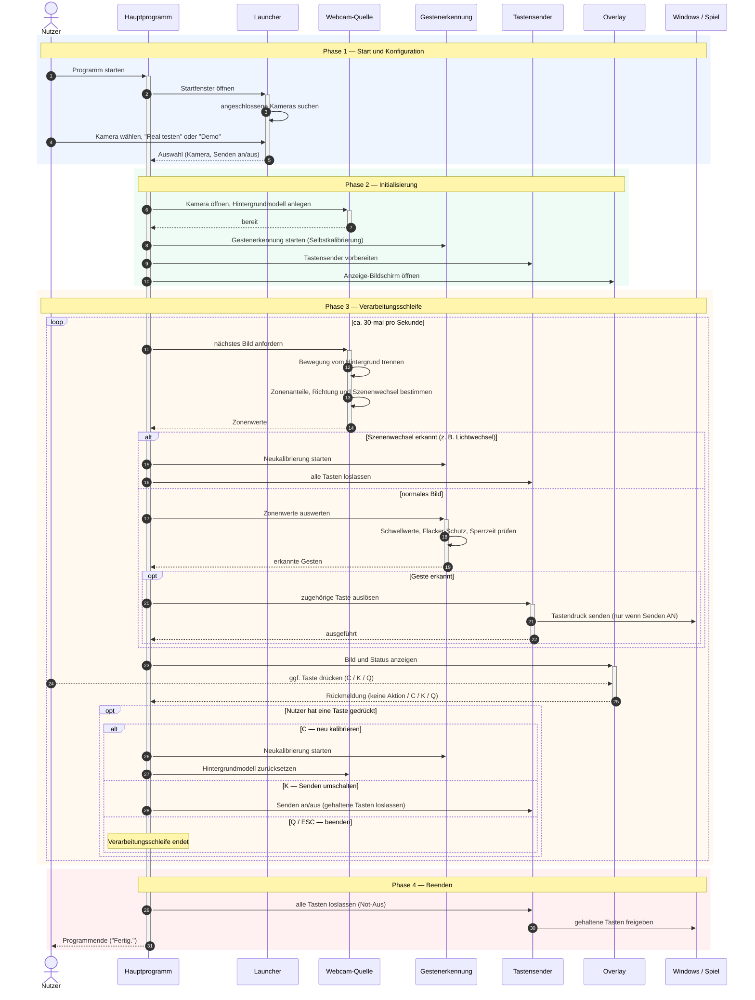

# Dokumentation: Entwicklungsprozess des Gestensteuerungs-Moduls

**Projekt:** Proj2_EAKA — Körpersteuerung für ein Subway-Surfer-artiges Spiel
**Finales Produkt:** `webcam-rust` (Version 1.1.2) — Webcam-basierte Gestensteuerung mit Tastatur-Emulation
**Zeitraum:** April – Juli 2026

---

## 1. Überblick

Ziel des Moduls ist es, Körperbewegungen einer spielenden Person in Tastendrücke zu übersetzen (A / D / Leertaste / S). Das Spiel selbst muss dafür nicht angepasst werden — aus seiner Sicht tippt einfach jemand auf der Tastatur. Wer vor der Kamera nach links greift, nach rechts greift, die Arme hebt oder sich duckt, steuert damit die Spielfigur.

Der Weg zum fertigen Produkt führte über fünf Entwicklungsstufen:

| # | Stufe | Modul | Sprache | Status |
|---|-------|-------|---------|--------|
| 0 | Projektplanung mit Kinect | `plan.md`, `planv2.md` | — | Konzept |
| 1 | Erster Prototyp (Kinect-Ansatz) | `prototyp/` | Python | als Referenz erhalten |
| 2 | Kinect-Port „Kinect++" | `kinect-input/` | C++ | entfernt (nur noch in der Projekthistorie) |
| 3 | Kinect-Port | `kinect-input-rust/` | Rust | entfernt (nur noch in der Projekthistorie) |
| 4 | **Kurswechsel:** Webcam-Prototyp | `prototyp/webcam/` | Python | als Referenz erhalten |
| 5 | **Finales Produkt** | `webcam-rust/` | Rust | aktiv, Version 1.1.2 |

Eine Grundidee zieht sich durch alle Stufen: die Verarbeitungskette **Quelle → Gestenerkennung → Tastensender**. Die *Quelle* liefert Bewegungsdaten (zuerst gedacht: Kinect-Sensor, am Ende: Webcam), die *Gestenerkennung* macht daraus Ereignisse wie „Sprung erkannt", und der *Tastensender* drückt die passende Taste. Weil diese drei Teile sauber getrennt sind, konnten Sensor und Programmiersprache mehrfach ausgetauscht werden, ohne jedes Mal bei null anzufangen. Außerdem ließ sich die Erkennungslogik in jeder Stufe automatisch testen — ganz ohne angeschlossene Hardware.

---

## 2. Historie

### 2.1 Phase 0 — Projektplanung mit Kinect (Mai 2026)

Der ursprüngliche Plan sah eine **Kinect v2** als Sensor vor — eine Tiefenkamera, die ursprünglich für die Xbox entwickelt wurde und Entfernungen im Raum messen kann. Zwei Planungsdokumente wogen die Möglichkeiten ab:

- **`plan.md`**: Spiel in Unity, daneben ein eigenständiges Programm, das die Kinect ausliest und die erkannten Gesten über eine lokale Netzwerkverbindung an das Spiel meldet. Wichtige Erkenntnis aus der Recherche: Die freie Kinect-Bibliothek `libfreenect2` liefert nur Kamera- und Tiefenbilder, aber **keine fertige Skelett-Erkennung** — die Gesten müssen also selbst aus den Rohdaten abgeleitet werden.
- **`planv2.md`**: Alternativvariante mit der Unreal Engine, mit derselben Empfehlung: den Sensor als eigenständiges Zusatzprogramm bauen und das Spiel zunächst ganz normal per Tastatur entwickeln.

Beide Pläne legten die Zielgesten fest — **Spurwechsel links/rechts, Springen, Ducken** — und entschieden sich für eine einfache, regelbasierte Erkennung: Aus den Tiefendaten werden Körperposition und Körperhöhe geschätzt; verlässt einer der Werte einen Schwellbereich, gilt die Geste als erkannt. Auf Machine-Learning-Modelle wurde bewusst verzichtet.

### 2.2 Phase 1 — Python-Prototyp mit Kinect-Ansatz (Juni 2026)

Der erste Prototyp (`prototyp/`) setzte die Verarbeitungskette in Python um — zunächst absichtlich **ohne echte Hardware**:

- Als Datenformat diente ein einfacher „Körperzustand": seitliche Position, Körperhöhe, Zeitpunkt. Genau das sollte die Kinect später liefern.
- Die **Gestenerkennung** kalibriert sich beim Start selbst: Etwa eine Sekunde lang ruhig stehen, daraus wird die Normalhaltung ermittelt. Danach gilt: Höhe steigt deutlich → Sprung; Höhe sinkt anhaltend → Ducken (Taste wird gehalten); Position wandert zur Seite → Spurwechsel. Eingebaute Schutzmechanismen verhindern Fehlauslösungen: eine kurze Sperrzeit nach jedem Sprung und ein „Puffer" zwischen Ein- und Ausschaltschwelle, damit Werte an der Grenze nicht hin- und herflackern.
- Der **Tastensender** drückt die Tasten über die Windows-Systemschnittstelle so, dass auch Spiele sie erkennen, die Tastatureingaben auf niedriger Ebene abfragen. Sicherheitsnetz von Anfang an: Standardmäßig werden Tastendrücke nur angezeigt statt gesendet („Trockenlauf"), und beim Beenden werden gehaltene Tasten garantiert losgelassen.
- Getestet wurde mit zwei Ersatzquellen: einer **Mock-Quelle** (spielt ein festes Bewegungs-Drehbuch mit künstlichem Messrauschen ab) und einer **manuellen Quelle** (Bewegungen werden per Konsolentaste simuliert). Acht automatische Tests sicherten das Verhalten ab.

Die Anbindung der echten Kinect blieb in dieser Phase bewusst offen — und genau dort begannen die Probleme.

### 2.3 Phasen 2 und 3 — Portierungen nach C++ und Rust (Juni 2026)

Der Python-Prototyp wurde anschließend zweimal originalgetreu portiert: zuerst nach **C++** (`kinect-input/`), dann als Experiment nach **Rust** (`kinect-input-rust/`). Beide Ports übernahmen Aufbau, Schwellwerte und alle acht Tests der Python-Referenz und ergänzten die für die jeweilige Sprache üblichen Sicherheitsmechanismen — etwa die Garantie, dass eine gehaltene Taste selbst bei einem Programmabsturz wieder losgelassen wird. Der Rust-Port kam zudem komplett ohne Fremdbibliotheken aus.

**Die Kinect-Hardware erwies sich in dieser Zeit als das zentrale Problem.** Der Sensor lief sehr instabil: Verbindungsabbrüche, Abhängigkeit vom konkreten USB-3-Controller des Rechners und eine schlechte Unterstützung unter Windows 11 machten es praktisch unmöglich, einen **verlässlichen, reproduzierbaren Entwicklungsstand** aufzubauen. Ob ein Fehler an der eigenen Software oder an der Hardware lag, war oft nicht unterscheidbar — entsprechend waren die Ergebnisse der Kinect-Phasen teilweise schlicht nicht gut, ohne dass die Erkennungslogik selbst daran schuld war. Hinzu kam: `libfreenect2` ist stark auf C++ zugeschnitten; eine Anbindung aus Rust hätte zusätzliche Brückenschichten erfordert. Die eigentliche Verarbeitungskette funktionierte in allen drei Sprachen nachweislich (alle Tests grün) — aber der Sensor davor blieb ein Unsicherheitsfaktor, der das ganze Projekt gefährdete.

Beide Kinect-Ports wurden nach dem Kurswechsel aus dem Projekt entfernt; sie sind über die Versionsverwaltung weiterhin einsehbar.

### 2.4 Der Kurswechsel: von Kinect zu Webcam (Juni 2026)

Die Konsequenz aus den Hardware-Problemen war ein bewusster Schnitt, festgehalten in den Konzeptdokumenten `KONZEPT_Webcam_Steuerung.txt` und `KONZEPT_Webcam_Steuerung_implementierung.txt`: **Die Kinect wird durch eine ganz normale Webcam ersetzt.** Eine Webcam ist überall verfügbar, läuft stabil und braucht keine Spezialtreiber.

Da eine Webcam keine Tiefendaten liefert, wurde die Erkennung neu gedacht: Statt Körperhöhe in Metern wird **Bewegung im Bild** ausgewertet. Das Programm lernt beim Start, wie der ruhige Hintergrund aussieht, und erkennt danach nur noch das, was sich davor bewegt (sogenannte Hintergrundsubtraktion). Das Bild wird in ein grobes Raster und vier Auswertezonen eingeteilt — links, rechts, oben, unten. Wie viel Bewegung in welcher Zone stattfindet, bestimmt die Geste. Auch hier: keine künstliche Intelligenz, nur nachvollziehbare Regeln.

Die Gesten wurden dabei ans Kamerabild angepasst: Springen heißt jetzt **Arme hoch** (ein echter Sprung ist im flachen Kamerabild kaum messbar), Spurwechsel heißt **Arm zur Seite strecken**, Ducken bleibt Ducken. Ein willkommener Nebeneffekt des neuen Ansatzes: Das, was das Programm „sieht", lässt sich direkt als Bild anzeigen — daraus entstand der Anzeige-Bildschirm, der das System für Zuschauer und Nutzer nachvollziehbar macht.

### 2.5 Phase 4 — Python-Webcam-Prototyp (Juni 2026)

Das Webcam-Konzept wurde zuerst wieder in Python erprobt (`prototyp/webcam/`): Kameraanbindung mit Hintergrundsubtraktion und Bewegungsraster, eine zonenbasierte Gestenerkennung mit denselben bewährten Schutzmechanismen (Selbstkalibrierung, Sperrzeit, Flacker-Puffer), ein zur Laufzeit ein- und ausschaltbarer Tastensender sowie das Overlay-Fenster mit Rasteranzeige und Sende-Status. Neun automatische Tests deckten die Erkennung ab — ausdrücklich schon als Vorlage für die spätere Rust-Umsetzung geschrieben. Wichtigste Praxiserkenntnis: Die Kamera muss auf ein komprimiertes Bildformat eingestellt werden, sonst bricht die Bildrate drastisch ein; und die Hintergrundsubtraktion blendet Bewegung im Publikum hinter der spielenden Person zuverlässig aus.

---

## 3. Finales Produkt: `webcam-rust` (Version 1.1.2)

### 3.1 Warum Rust — und was das Produkt ausmacht

Die endgültige Fassung wurde in **Rust komplett neu entwickelt**. Der Python-Prototyp diente dabei nur als fachliche Vorlage für das Erkennungskonzept — der Code selbst entstand von Grund auf neu, in einer kompilierten, schnellen Sprache mit strengen Sicherheitsgarantien, die sich als einzelnes Programm ohne Python-Installation weitergeben lässt. Die Neuentwicklung war zugleich die Gelegenheit, deutlich über den Prototyp hinauszugehen: Es kamen unter anderem das Startfenster mit Kameraauswahl, zonenspezifische Schwellwerte, der Bewegungsrichtungs-Filter und die automatische Neukalibrierung hinzu (Details in 3.4).

Das Ergebnis ist gegenüber allen Kinect-Vorstufen nicht nur stabiler, sondern auch **für die Nutzer deutlich ersichtlicher**: Der Anzeige-Bildschirm zeigt live, was das System wahrnimmt — das Kamerabild, die erkannte Bewegung, die vier Zonen, die zuletzt ausgelöste Taste und ob Tastendrücke gerade wirklich gesendet werden. Wer davorsteht, versteht ohne Erklärung, warum gerade eine Taste ausgelöst wurde (oder warum nicht). Bei der Kinect war das System dagegen eine Blackbox, deren Verhalten durch die instabile Hardware zusätzlich unberechenbar wirkte.

### 3.2 Die Bausteine

| Baustein | Aufgabe |
|----------|---------|
| Launcher | Startfenster: findet angeschlossene Kameras, Auswahl **„Real testen"** (Tasten werden gesendet), **„Demo"** (nur Anzeige) oder **„Abbrechen"** |
| Webcam-Quelle | liest die Kamera aus, trennt Bewegung vom Hintergrund, berechnet die Bewegungsanteile je Zone |
| Gestenerkennung | entscheidet anhand der Zonenwerte, ob eine Geste vorliegt — mit Kalibrierung und Schutzmechanismen |
| Tastensender | drückt die Tasten auf Systemebene; kennt einen Demo-Modus, in dem nur protokolliert wird |
| Overlay | der Anzeige-Bildschirm (siehe oben), auf Wunsch auf einem zweiten Monitor |
| Mock-/Manuell-Quelle | Ersatzquellen für Vorführungen und Entwicklung ohne Kamera |
| Konfiguration | alle Schwellwerte und Zonen-Grenzen zentral an einer Stelle |

### 3.3 Zonen und Tastenbelegung

Das Kamerabild ist in vier Zonen geteilt; die Bildmitte ist bewusst neutrale Ruhezone:

| Zone | Geste | Taste | Verhalten |
|------|-------|-------|-----------|
| links | Arm nach links strecken | **A** | kurzer Tastendruck |
| rechts | Arm nach rechts strecken | **D** | kurzer Tastendruck |
| oben Mitte | Arme hochreißen | **Leertaste** (Sprung) | kurzer Tastendruck |
| unteres Band | Ducken | **S** | Taste wird gehalten, solange geduckt |

### 3.4 Was bei jedem Kamerabild passiert

1. **Bewegung erkennen:** Das aktuelle Bild wird mit dem gelernten Hintergrund verglichen; übrig bleibt nur die Silhouette der Bewegung. Schatten und Bildrauschen werden herausgefiltert.
2. **Vergröbern:** Die Silhouette wird auf ein Raster von 32 × 24 Feldern reduziert. Für jede der vier Zonen wird berechnet, wie viel Prozent ihrer Felder „in Bewegung" sind.
3. **Plausibilität prüfen** (neu in Version 1.1.1):
   - Jede Zone hat **eigene, abgestimmte Schwellwerte** — die Sprungzone reagiert z. B. empfindlicher als die Duckzone.
   - Ein **Bewegungsrichtungs-Filter** prüft, ob sich die Bewegung tatsächlich in die passende Richtung bewegt (nach links, nach rechts, nach oben). Zappeln ohne klare Richtung löst keine Taste mehr aus.
   - Eine **automatische Neukalibrierung** greift, wenn plötzlich fast das ganze Bild als „Bewegung" gilt — typisch bei Lichtwechsel oder einem Stoß gegen die Kamera. Das System lernt den Hintergrund dann neu, statt wild Tasten zu drücken.
4. **Geste entscheiden:** Überschreitet eine Zone ihre Schwelle über mehrere Bilder hinweg, gilt die Geste als erkannt. Melden sich mehrere Zonen gleichzeitig, gewinnt die mit der stärksten Bewegung; nach jedem Auslösen gilt eine halbe Sekunde Sperrzeit.
5. **Taste senden:** Die erkannte Geste wird in den zugehörigen Tastendruck übersetzt — im Demo-Modus nur ins Protokoll geschrieben.
6. **Anzeigen:** Das Overlay stellt alles dar. Per Tastendruck lässt sich dort zwischen Kamerabild und Bewegungsansicht umschalten (`M`), neu kalibrieren (`C`), das Senden ein-/ausschalten (`K`) und beenden (`Q`/ESC).

### 3.5 Sicherheit und Qualitätssicherung

Gehaltene Tasten werden auf jedem Beendigungsweg garantiert losgelassen — beim normalen Beenden, beim Ausschalten des Sendens und bei jeder Neukalibrierung. So bleibt nie eine „klemmende" Taste im Spiel zurück. Die Erkennungslogik ist weiterhin komplett ohne Kamera testbar: 14 automatische Tests prüfen Kalibrierung, Einmal-Auslösung, Sperrzeit, Flacker-Schutz, die Konfliktauflösung zwischen Zonen und die neuen Plausibilitäts-Filter.

---

## 4. Sequenzdiagramm: Verarbeitungsablauf zur Laufzeit

Das Diagramm zeigt den Ablauf des finalen Produkts in vier farblich markierten Phasen: Start und Konfiguration, Initialisierung, die fortlaufende Verarbeitungsschleife und das Beenden. Durchgezogene Pfeile sind Aufrufe, gestrichelte Pfeile die zugehörigen Antworten; die schmalen Balken auf den Lebenslinien zeigen, welcher Baustein gerade aktiv arbeitet.

GitHub-Release: https://github.com/Enrico2802/Proj2_EAKA/releases/tag/webcam-rust-v1.1.2

---

*Stand: 09.07.2026 — erstellt aus dem aktuellen Projektstand (Version 1.1.2) und der Projekthistorie; die entfernten Kinect-Module wurden aus der Versionsverwaltung rekonstruiert.*
