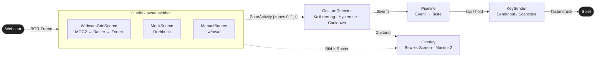
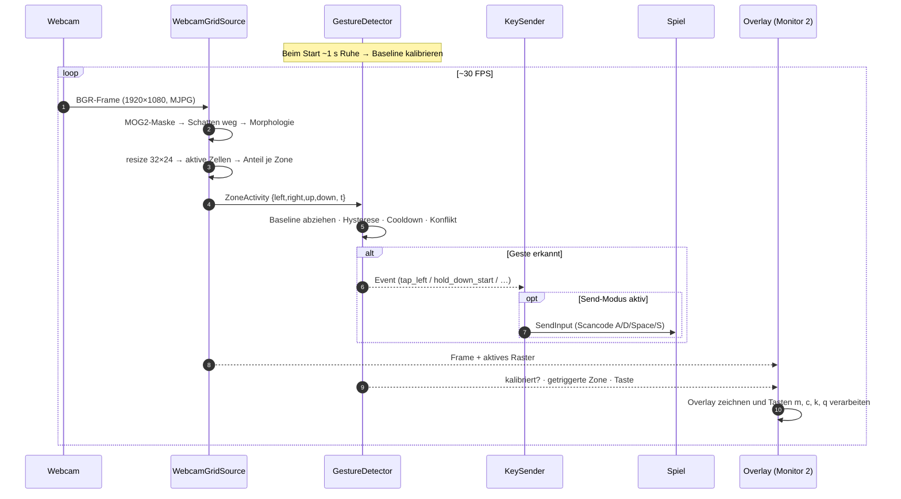
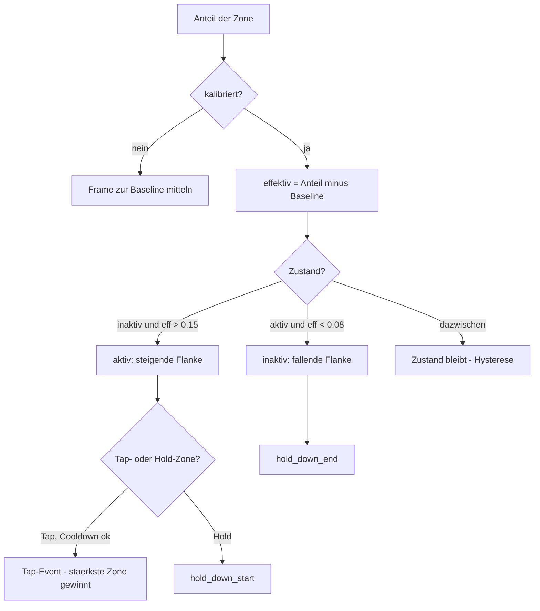

# Bewegungssteuerung → Tastatur

Steuerungs-Komponente eines Subway-Surfer-artigen Uni-Projekts: Die Software
erkennt Körpergesten vor einer **Webcam** und sendet **echte Tastendrücke** über
die Windows-API `SendInput()` (Scancodes). Das Spiel braucht dadurch keinerlei
Anbindung — es liest die Tasten wie von einer normalen Tastatur.

> **Hintergrund:** Ursprünglich war eine **Kinect v2** geplant. Die Hardware ist
> unter Windows 11 instabil (libfreenect2 liefert nur Tiefenbilder, kein
> Skelett). Darum der Umstieg auf eine normale **Webcam** mit einem robusten
> **Bewegungs-Raster-Ansatz** (Motion-Energy-Grid statt Skelett): kein ML-Modell
> nötig, nur OpenCV + NumPy — und das Kamerabild ist gleichzeitig der
> „Beweis-Screen" für die Ausstellung. Der alte Kinect-Prototyp bleibt als
> Referenz erhalten (→ [Historie](#historie--legacy)).

## Funktionsprinzip

Statt eines Skeletts wird pro Bild gemessen, **wo Bewegung stattfindet**:

1. **Hintergrund-Subtraktion** (MOG2) trennt die bewegte Person vom statischen
   Hintergrund → Vordergrundmaske (Publikum/Trubel im Hintergrund stört nicht).
2. Die Maske wird auf ein **32×24-Raster** verkleinert; jede Zelle ist „aktiv",
   wenn dort genug Bewegung ist.
3. Pro **Zone** (links/rechts/oben/unten) wird der **Anteil** aktiver Zellen
   berechnet (0..1). Der Anteil — nicht eine absolute Zellzahl — ist der
   Auslöser, dadurch ist die Logik **auflösungsunabhängig**.
4. Ein **Detektor** macht aus den Zonen-Anteilen Gesten (mit Kalibrierung,
   Hysterese, Cooldown) und ein **KeySender** daraus Tastendrücke.

### Gesten → Tasten (Default, zentral konfigurierbar)

| Zone           | Geste                | Taste            | Art  |
| -------------- | -------------------- | ---------------- | ---- |
| oben Mitte     | Arme hoch            | Leertaste        | Tap  |
| links          | Arm in linke Ecke    | A                | Tap  |
| rechts         | Arm in rechte Ecke   | D                | Tap  |
| unteres Band   | Ducken / Hocken      | S                | Hold |

Schwellen anteilig: **15 % rein / 8 % raus** (Hysterese gegen Flackern),
**0,5 s Cooldown** je Tap, ~1 s Selbst-Kalibrierung beim Start.

## Architektur



Der **GestureDetector** kennt nur das `ZoneActivity`-Objekt (vier Zahlen + Zeit)
— nicht die Kamera. Dadurch ist die Kernlogik ohne Hardware per Unit-Tests
absicherbar und 1:1 zwischen Python und Rust portierbar. Mock-/Manual-Quelle
liefern dasselbe Objekt und erlauben Ende-zu-Ende-Tests ohne Kamera.

### Datenfluss pro Frame



### Detektor-Logik (je Zone)



## Implementierungen

| Variante | Ordner | Status | Sprache / Stack |
| --- | --- | --- | --- |
| **Webcam – Python** (Referenz) | [`prototyp/webcam/`](prototyp/webcam/) | fertig, Live ok | Python 3, OpenCV, NumPy |
| **Webcam – Rust** (Performance/Deploy) | [`webcam-rust/`](webcam-rust/) | fertig, Live-Test offen | Rust, opencv-Crate, minifb |
| Kinect – Python | siehe [Historie](#historie--legacy) | eingefroren | — |

Beide Webcam-Varianten teilen denselben Daten-Vertrag, dieselben anteiligen
Schwellwerte und dieselben **9 Unit-Tests** der Detektor-Logik.

### Webcam – Python (`prototyp/webcam/`)

```powershell
cd prototyp\webcam
pip install -r requirements.txt

python main.py                          # Mock-Drehbuch, Dry-Run
python main.py --source manual          # w/a/s/d steuern, q=Ende
python main.py --source webcam          # echte Kamera, Dry-Run + Overlay
python main.py --source webcam --send   # echte Kamera + ECHTE Tasten
python -m unittest -v                   # 9 Unit-Tests (ohne Kamera)
```

### Webcam – Rust (`webcam-rust/`)

Toolchain: **MSYS2 UCRT64** (`pacman -S mingw-w64-ucrt-x86_64-{rust,opencv,clang}`).
`C:\msys64\ucrt64\bin` muss zum Ausführen im PATH liegen (OpenCV-DLLs).

```powershell
$env:Path = "C:\msys64\ucrt64\bin;" + $env:Path
cd webcam-rust

cargo test                          # 9 Detector-Tests
cargo run                           # Mock-Drehbuch, Dry-Run
cargo run -- --source webcam        # echte Kamera, Dry-Run + Overlay
cargo run -- --source webcam --send # echte Kamera + ECHTE Tasten
cargo run --bin probe               # Kamera-Diagnose
```

> Details & Stolperfallen (opencv-Crate ≥ 0.98 für OpenCV 4.13; `highgui`
> entfällt wegen Qt → Fenster via `minifb`) stehen in der
> [`webcam-rust/README.md`](webcam-rust/README.md).

Im Overlay-Fenster (beide Varianten): **`m`** Bild/Maske · **`c`** neu
kalibrieren · **`k`** Send an/aus · **`q`**/`ESC` Ende (löst gehaltene Tasten).

## Repo-Struktur

```
prototyp/            # Kinect-Python-Prototyp (Legacy, BodyState-basiert)
prototyp/webcam/     # AKTUELL: Webcam-Steuerung in Python
webcam-rust/         # AKTUELL: Webcam-Steuerung in Rust
KONZEPT_Webcam_Steuerung*.txt   # Konzept + präziser Implementierungs-Bauplan
```

## Konfiguration

Alle Parameter zentral in `config.py` bzw. `src/config.rs`: Kamera-Index,
Auflösung, Rastergröße, Zonen-Rechtecke, Schwellen (enter/exit), Cooldown,
Tastenbelegung, Monitor-2-Offset. Die Zonen dürfen sich **nicht überlappen**,
sonst lösen mehrere Tasten gleichzeitig aus.

Die Webcam läuft auf **FullHD @ 30 FPS** (MJPG erzwungen; ohne MJPG fällt die
Kamera auf unkomprimiertes YUY2 und ~5 FPS zurück).

## Historie / Legacy

Frühere Kinect-v2-Variante (Skelett-Ersatz über Tiefen-Schwerpunkt + Körperhöhe,
Datenmodell `BodyState(x, height, t)`):

- [`prototyp/`](prototyp/) — Python-Referenz (Sprung über Körperhöhe, Ducken=Strg).

Dieser Prototyp ist eingefroren; die Kinect-Anbindung (`libfreenect2`) wurde zugunsten der
Webcam-Lösung nicht weiterverfolgt. Architektur-Notizen: [`plan.md`](plan.md),
[`planv2.md`](planv2.md).
